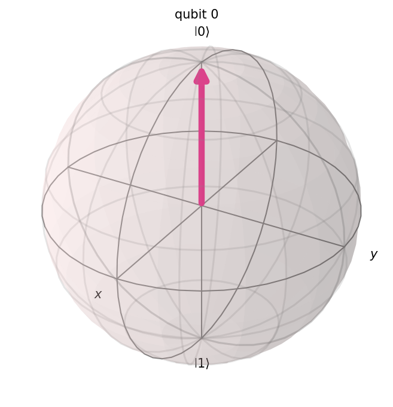
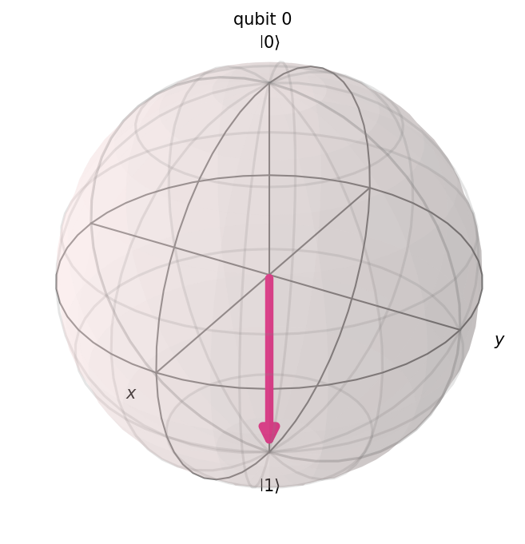
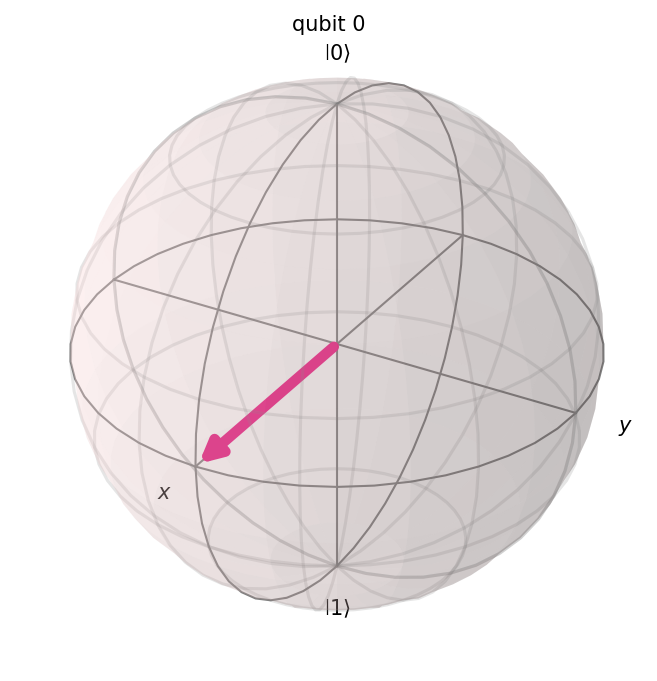
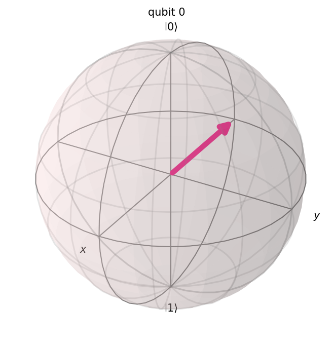
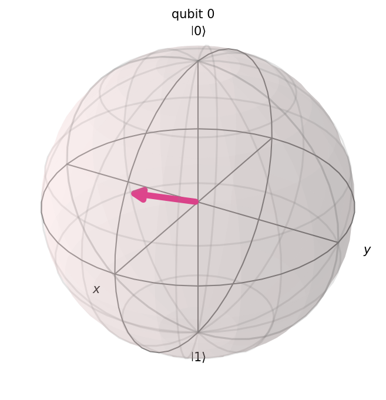
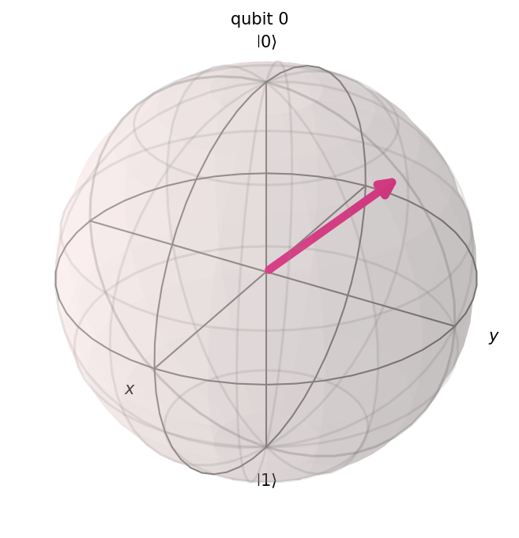
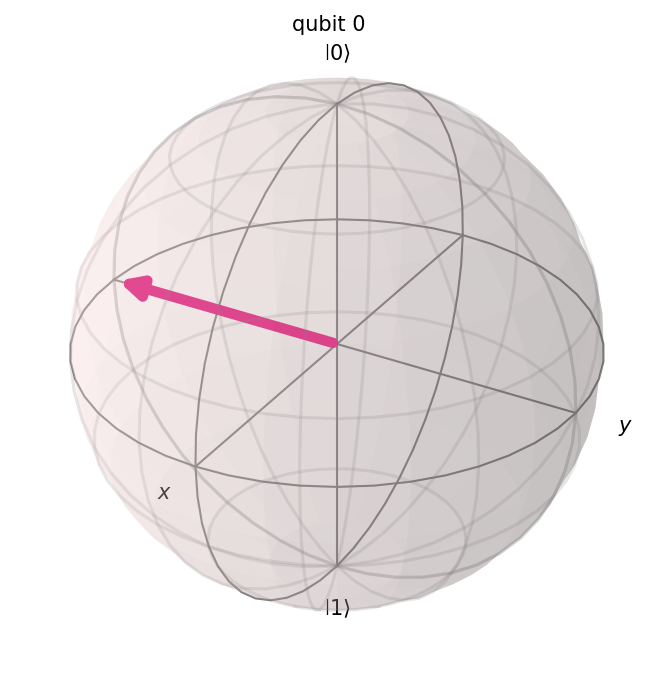

# Lab 1 Report: Qubits and Quantum States

**Course:** SCI-104 – Mathematical Foundations and Quantum Mechanics Essentials
**Institution:** Prince of Songkla University, Phuket Campus

| Field | Detail |
|---|---|
| Lab | Lab 1 – Qubit, Dirac Notation, and the Bloch Sphere |
| Student Name | Yamalluddin Chahama |
| Student ID | 6930614038 |
| Major | AISE |
| Instructor | Komsan Kanjanasit |
| Date Performed | 2026-10-06 |
| Date Submitted | 2026-10-20 |
| Colab Notebook | https://colab.research.google.com/drive/1TWN2lQsDDhw3wmvHrBHBVUT4R95uJ0KU?usp=sharing |

---

## Abstract

In this lab, single-qubit states were represented in Dirac notation and visualized on the Bloch sphere using Qiskit. The basis states $\lvert0\rangle$, $\lvert1\rangle$, the superposition states $\lvert+\rangle$, $\lvert-\rangle$, and a state produced by $R_y(\pi/3)$ were built as quantum circuits, and their state vectors and Bloch vectors were compared with hand calculations. All simulated results agreed with theory (for example, $R_y(\pi/3)\lvert0\rangle = 0.866\lvert0\rangle + 0.5\lvert1\rangle$ with $P(0) = 0.75$). The exercises showed that states with $\theta = \pi/2$ lie on the equator, that a global phase changes neither probabilities nor the Bloch vector, and that $R_x, R_y, R_z$ rotate the Bloch vector about the $x, y, z$ axes. The main lesson is that the relative phase, not the global phase, distinguishes states such as $\lvert+\rangle$ and $\lvert-\rangle$ that have identical measurement probabilities.

## 1. Objectives

1. To represent a qubit in **Dirac notation** and in the computational basis.
2. To translate between Dirac notation and column-vector form.
3. To use **Qiskit** to build and visualize single-qubit states.
4. To plot and interpret **Bloch sphere** representations.
5. To observe how quantum gates (X, H, $R_x$, $R_y$, $R_z$) move states on the Bloch sphere.

## 2. Background

### 2.1 The Qubit

A classical bit is either 0 or 1. A qubit can be in a **superposition** of both basis states, described by two complex numbers called amplitudes. When the qubit is measured, the result is 0 or 1 with probabilities given by the squared magnitudes of the amplitudes.

$$\lvert\psi\rangle = \alpha\lvert0\rangle + \beta\lvert1\rangle, \qquad \alpha,\beta \in \mathbb{C}, \qquad \lvert\alpha\rvert^2 + \lvert\beta\rvert^2 = 1$$

$$\lvert0\rangle = \begin{bmatrix}1\\0\end{bmatrix}, \qquad \lvert1\rangle = \begin{bmatrix}0\\1\end{bmatrix}$$

### 2.2 Dirac Notation

| Symbol | Name | Meaning |
|---|---|---|
| $\lvert\psi\rangle$ | ket | A state written as a column vector, e.g. $\begin{bmatrix}\alpha\\\beta\end{bmatrix}$ |
| $\langle\psi\rvert$ | bra | The conjugate transpose of the ket, a row vector $[\alpha^*\ \ \beta^*]$ |
| $\langle\phi\lvert\psi\rangle$ | inner product | A complex number measuring the overlap of two states; $\langle\psi\lvert\psi\rangle = 1$ for a normalized state |
| $\lvert\alpha\rvert^2$ | — | Probability of measuring 0 |
| $\lvert\beta\rvert^2$ | — | Probability of measuring 1 |

### 2.3 Bloch Sphere Representation

Any pure single-qubit state can be written, up to a global phase, as

$$\lvert\psi\rangle = \cos\frac{\theta}{2}\lvert0\rangle + e^{i\varphi}\sin\frac{\theta}{2}\lvert1\rangle, \qquad 0 \le \theta \le \pi, \quad 0 \le \varphi < 2\pi$$

Cartesian coordinates of the Bloch vector:

$$(x, y, z) = (\sin\theta\cos\varphi,\ \sin\theta\sin\varphi,\ \cos\theta)$$

$\theta$ is the polar angle measured from the $+z$ axis and $\varphi$ is the azimuthal angle around the $z$ axis. The north pole ($\theta=0$) is $\lvert0\rangle$ and the south pole ($\theta=\pi$) is $\lvert1\rangle$. The equator ($\theta=\pi/2$) holds the equal-probability superpositions, with $\varphi$ choosing the direction on the equator. The half-angle $\theta/2$ appears because $\lvert0\rangle$ and $\lvert1\rangle$ are orthogonal (90°) as vectors but opposite (180°) on the sphere.

### 2.4 Gates Used in This Lab

| Gate | Matrix | Effect on the Bloch sphere |
|---|---|---|
| $X$ | $\begin{bmatrix}0&1\\1&0\end{bmatrix}$ | Rotation by $\pi$ about $x$; swaps $\lvert0\rangle \leftrightarrow \lvert1\rangle$ (north ↔ south pole) |
| $H$ | $\frac{1}{\sqrt2}\begin{bmatrix}1&1\\1&-1\end{bmatrix}$ | Rotation by $\pi$ about the $(x+z)/\sqrt2$ axis; $\lvert0\rangle \to \lvert+\rangle$ ($+z \to +x$) |
| $R_x(\lambda)$ | $\begin{bmatrix}\cos\frac\lambda2 & -i\sin\frac\lambda2\\-i\sin\frac\lambda2 & \cos\frac\lambda2\end{bmatrix}$ | Rotates the Bloch vector by $\lambda$ about the $x$ axis |
| $R_y(\lambda)$ | $\begin{bmatrix}\cos\frac\lambda2 & -\sin\frac\lambda2\\\sin\frac\lambda2 & \cos\frac\lambda2\end{bmatrix}$ | Rotates the Bloch vector by $\lambda$ about the $y$ axis |
| $R_z(\lambda)$ | $\begin{bmatrix}e^{-i\lambda/2}&0\\0&e^{i\lambda/2}\end{bmatrix}$ | Rotates the Bloch vector by $\lambda$ about the $z$ axis (changes $\varphi$) |

*Note: $\lambda$ is the rotation angle of the gate. It is different from the Bloch sphere angle $\theta$ in Section 2.3.*

## 3. Tools and Environment

| Item | Version / Detail |
|---|---|
| Platform | Local macOS machine |
| Python | 3.9.6 |
| qiskit | 2.2.3 |
| Other libraries | numpy 2.0.2, matplotlib 3.9.4, pylatexenc 2.11 |

## 4. Lab Tasks and Results

### Task 1 — Setup

```python
!pip install qiskit qiskit-aer
from qiskit import QuantumCircuit
from qiskit.quantum_info import Statevector
from qiskit.visualization import plot_bloch_multivector
```

**Observation:** Qiskit imported successfully. The package `pylatexenc`, which some Qiskit drawing styles need, was missing and was installed with `pip install pylatexenc`. A `DeprecationWarning` states that Qiskit will drop Python 3.9 support in version 2.3.0; it does not affect the results.

### Task 2 — Representing $\lvert0\rangle$ and $\lvert1\rangle$

```python
qc0 = QuantumCircuit(1)
qc1 = QuantumCircuit(1); qc1.x(0)

state0 = Statevector.from_instruction(qc0)
state1 = Statevector.from_instruction(qc1)

display(plot_bloch_multivector(state0))
display(plot_bloch_multivector(state1))
```

| State | Statevector output | Bloch sphere |
|---|---|---|
| $\lvert0\rangle$ | `[1.+0.j, 0.+0.j]` |  |
| $\lvert1\rangle$ | `[0.+0.j, 1.+0.j]` |  |

**Observation:** $\lvert0\rangle$ has Bloch vector $(0,0,1)$ and points to the north pole ($\theta=0$). $\lvert1\rangle$ has Bloch vector $(0,0,-1)$ and points to the south pole ($\theta=\pi$). The $X$ gate moved the state from one pole to the other. Measuring gives $P(0)=1$ for $\lvert0\rangle$ and $P(1)=1$ for $\lvert1\rangle$.

### Task 3 — Superposition States

```python
qc_plus = QuantumCircuit(1); qc_plus.h(0)
qc_minus = QuantumCircuit(1); qc_minus.x(0); qc_minus.h(0)

state_plus = Statevector.from_instruction(qc_plus)
state_minus = Statevector.from_instruction(qc_minus)

display(plot_bloch_multivector(state_plus))
display(plot_bloch_multivector(state_minus))
```

| State | Dirac form (by hand) | Statevector output | Bloch sphere |
|---|---|---|---|
| $\lvert+\rangle$ | $\frac1{\sqrt2}(\lvert0\rangle+\lvert1\rangle)$ | `[0.7071+0.j, 0.7071+0.j]` |  |
| $\lvert-\rangle$ | $\frac1{\sqrt2}(\lvert0\rangle-\lvert1\rangle)$ | `[0.7071+0.j, -0.7071+0.j]` |  |

**Hand calculation:**

$$H\lvert0\rangle = \frac1{\sqrt2}\begin{bmatrix}1&1\\1&-1\end{bmatrix}\begin{bmatrix}1\\0\end{bmatrix} = \frac1{\sqrt2}\begin{bmatrix}1\\1\end{bmatrix} = \lvert+\rangle$$

$$H\lvert1\rangle = \frac1{\sqrt2}\begin{bmatrix}1&1\\1&-1\end{bmatrix}\begin{bmatrix}0\\1\end{bmatrix} = \frac1{\sqrt2}\begin{bmatrix}1\\-1\end{bmatrix} = \lvert-\rangle$$

($\lvert-\rangle$ was built as $HX\lvert0\rangle = H\lvert1\rangle$.)

**Expected vs. observed:**

| State | Expected position | Observed position | Match? |
|---|---|---|---|
| $\lvert+\rangle$ | equator, $+x$ axis | Bloch vector $(1,0,0)$ | ✔ |
| $\lvert-\rangle$ | equator, $-x$ axis | Bloch vector $(-1,0,0)$ | ✔ |

Both states have $P(0)=P(1)=0.5$, so a measurement cannot tell them apart. They differ only in the sign (relative phase $\varphi=\pi$) of the $\lvert1\rangle$ amplitude, which appears as opposite directions on the $x$ axis.

### Task 4 — Arbitrary Rotation

```python
from math import pi
qc = QuantumCircuit(1)
qc.ry(pi/3, 0)   # Rotate around Y by 60 degrees
state = Statevector.from_instruction(qc)
plot_bloch_multivector(state)
```

**Hand calculation:** $R_y(\lambda)\lvert0\rangle = \cos\frac\lambda2\lvert0\rangle + \sin\frac\lambda2\lvert1\rangle$, so with $\lambda=\pi/3$: $\alpha=\cos30° = \frac{\sqrt3}2,\ \beta=\sin30°=\frac12$.



| Quantity | Hand calculation | Qiskit result |
|---|---|---|
| $\alpha$ | $\frac{\sqrt3}2 \approx 0.866$ | 0.866 |
| $\beta$ | $\frac12 = 0.5$ | 0.5 |
| $P(0)=\lvert\alpha\rvert^2$ | $\frac34 = 0.75$ | 0.75 |
| $P(1)=\lvert\beta\rvert^2$ | $\frac14 = 0.25$ | 0.25 |
| $(\theta,\varphi)$ | $(\pi/3,\ 0)$ | Bloch vector $(0.866, 0, 0.5)$, i.e. $\theta=60°,\varphi=0$ |

**Observation:** Starting from the north pole, the state moved 60° toward $+x$ in the $xz$-plane. The Bloch vector $(\sin60°, 0, \cos60°) = (0.866, 0, 0.5)$ agrees exactly with the hand calculation. Since $\alpha$ and $\beta$ are real, $\varphi = 0$.

## 5. Exercises

### Exercise 1 — General State Exploration ($\theta=\pi/4,\ \varphi=\pi/2$)

**Dirac form (by hand):**

$$\lvert\psi\rangle = \cos\frac\pi8\lvert0\rangle + e^{i\pi/2}\sin\frac\pi8\lvert1\rangle = 0.924\lvert0\rangle + 0.383i\lvert1\rangle$$

Expected Bloch vector: $(\sin\frac\pi4\cos\frac\pi2,\ \sin\frac\pi4\sin\frac\pi2,\ \cos\frac\pi4) = (0,\ 0.707,\ 0.707)$.

```python
qc = QuantumCircuit(1)
qc.ry(pi/4, 0)   # sets theta
qc.rz(pi/2, 0)   # sets phi
state = Statevector.from_instruction(qc)
print(state)
display(plot_bloch_multivector(state))
```



**Observation:** Qiskit gave `[0.6533-0.6533j, 0.2706+0.2706j]` with $P(0)=0.854, P(1)=0.146$ and Bloch vector $(0, 0.707, 0.707)$, matching the expected values. The amplitudes differ from the hand form by a factor $e^{-i\pi/4}$: Qiskit's $R_z(\lambda) = \mathrm{diag}(e^{-i\lambda/2}, e^{i\lambda/2})$ includes a global phase. A global phase does not change the physical state (see Exercise 3), and the relative phase of $\lvert1\rangle$ to $\lvert0\rangle$ is still $e^{i\pi/2}$.

### Exercise 2 — Equator States

**Proof / argument:** For $\theta=\pi/2$, the Bloch vector is $(\sin\frac\pi2\cos\varphi,\ \sin\frac\pi2\sin\varphi,\ \cos\frac\pi2) = (\cos\varphi,\ \sin\varphi,\ 0)$. Its $z$ component is 0 for every $\varphi$, so the state lies in the $xy$-plane, which is the equator. The probabilities are $\cos^2\frac\pi4 = \sin^2\frac\pi4 = \frac12$, independent of $\varphi$.

```python
for phi in [0, pi/2, pi, 3*pi/2]:
    qc = QuantumCircuit(1)
    qc.ry(pi/2, 0)
    qc.rz(phi, 0)
    state = Statevector.from_instruction(qc)
    display(plot_bloch_multivector(state))
```

| $\varphi$ | Bloch vector $(x,y,z)$ | On equator? |
|---|---|---|
| 0 | $(1, 0, 0)$ | ✔ |
| $\pi/2$ | $(0, 1, 0)$ | ✔ |
| $\pi$ | $(-1, 0, 0)$ | ✔ |
| $3\pi/2$ | $(0, -1, 0)$ | ✔ |

All four points have $z=0$ and lie 90° apart around the equator, and every one gives $P(0)=P(1)=0.5$.

### Exercise 3 — Global Phase

**Proof:** Let $\lvert\psi'\rangle = e^{i\gamma}\lvert\psi\rangle = e^{i\gamma}\alpha\lvert0\rangle + e^{i\gamma}\beta\lvert1\rangle$. Then

$$\lvert e^{i\gamma}\alpha\rvert^2 = \lvert e^{i\gamma}\rvert^2\lvert\alpha\rvert^2 = \lvert\alpha\rvert^2$$

and likewise for $\beta$, so the probabilities are unchanged. The relative phase is also unchanged, since $\frac{e^{i\gamma}\beta}{e^{i\gamma}\alpha} = \frac\beta\alpha$, so $\theta$ and $\varphi$, and hence the Bloch vector, are unchanged.

```python
import numpy as np
sv  = Statevector.from_instruction(qc)              # state from Exercise 1
sv2 = Statevector(sv.data * np.exp(1j * 1.234))      # global phase gamma = 1.234
print(sv.probabilities(), sv2.probabilities())
display(plot_bloch_multivector(sv)); display(plot_bloch_multivector(sv2))
```

**Result:** Both states give probabilities `[0.8536, 0.1464]` and the same Bloch vector $(0, 0.707, 0.707)$. The two Bloch spheres are identical, confirming that a global phase is not physically observable.

### Exercise 4 — Rotation Experiment

```python
for gate in ["rx", "ry", "rz"]:
    qc = QuantumCircuit(1)
    getattr(qc, gate)(pi/2, 0)
    state = Statevector.from_instruction(qc)
    print(gate, state)
    display(plot_bloch_multivector(state))
```

| Gate applied to $\lvert0\rangle$ | Statevector | Final Bloch vector $(x,y,z)$ | Bloch sphere |
|---|---|---|---|
| $R_x(\pi/2)$ | `[0.7071+0.j, 0-0.7071j]` | $(0, -1, 0)$ |  |
| $R_y(\pi/2)$ | `[0.7071+0.j, 0.7071+0.j]` | $(1, 0, 0)$ |  |
| $R_z(\pi/2)$ | `[0.7071-0.7071j, 0+0j]` | $(0, 0, 1)$ |  |

**Observation:** $R_x(\pi/2)$ rotates the north pole by 90° about $x$ and ends at $-y$. $R_y(\pi/2)$ rotates it about $y$ and ends at $+x$. $R_z(\pi/2)$ leaves the state at the north pole, because $\lvert0\rangle$ already lies on the $z$ axis, the rotation axis. Its only effect is a global phase $e^{-i\pi/4}$, which is unobservable. This shows that $R_z$ only changes $\varphi$ and cannot move a state that sits on the $z$ axis.

## 6. Concept Questions

**Q1. Geometrically, what does $\lvert\psi\rangle = (\lvert0\rangle+\lvert1\rangle)/\sqrt2$ represent on the Bloch sphere?**

> This is the state $\lvert+\rangle$. It has $\theta=\pi/2$ and $\varphi=0$, so it lies on the equator at the $+x$ axis, Bloch vector $(1,0,0)$. It is an equal superposition with $P(0)=P(1)=0.5$.

**Q2. Why must $\lvert\alpha\rvert^2+\lvert\beta\rvert^2=1$ for a valid qubit state?**

> $\lvert\alpha\rvert^2$ and $\lvert\beta\rvert^2$ are the probabilities of the two possible measurement outcomes, and the probabilities of all outcomes must sum to 1. Equivalently, a state must be a unit vector ($\langle\psi\lvert\psi\rangle=1$), which is also what lets it be placed on the surface of the unit Bloch sphere.

**Q3. What is the difference between a global phase and a relative phase?**

> A global phase multiplies the whole state, $e^{i\gamma}(\alpha\lvert0\rangle+\beta\lvert1\rangle)$. It changes neither the probabilities nor the Bloch vector, so it has no physical effect. A relative phase is the phase difference between the $\lvert0\rangle$ and $\lvert1\rangle$ amplitudes ($\varphi$). It does change the state: it moves the Bloch vector around the $z$ axis and, for example, distinguishes $\lvert+\rangle$ from $\lvert-\rangle$.

**Q4. Which states lie at the poles of the Bloch sphere?**

> The north pole ($\theta=0$) is $\lvert0\rangle$ and the south pole ($\theta=\pi$) is $\lvert1\rangle$. These are the computational basis states and are the definite outcomes of a measurement in the $z$ basis.

**Q5. How do the rotation gates $R_x, R_y, R_z$ correspond to movements on the Bloch sphere?**

> $R_x(\lambda)$, $R_y(\lambda)$ and $R_z(\lambda)$ rotate the Bloch vector by the angle $\lambda$ about the $x$, $y$ and $z$ axes respectively. $R_z$ changes only the azimuthal angle $\varphi$ (relative phase), while $R_x$ and $R_y$ change $\theta$ and so change the measurement probabilities. Every single-qubit gate corresponds to some rotation of the sphere.

## 7. Discussion

**Theory vs. simulation.** All Qiskit results matched the hand calculations: the state vectors of $\lvert0\rangle$, $\lvert1\rangle$, $\lvert+\rangle$, $\lvert-\rangle$, the amplitudes 0.866 and 0.5 for $R_y(\pi/3)\lvert0\rangle$, and every Bloch vector in Exercises 2 and 4. The only difference appeared in Exercise 1, where Qiskit's amplitudes carried an extra global phase $e^{-i\pi/4}$ because its $R_z$ is defined as $\mathrm{diag}(e^{-i\lambda/2}, e^{i\lambda/2})$. This did not change the physical state, which matches the result of Exercise 3.

**Problems faced.** The `pylatexenc` package was missing and had to be installed. When the script was first saved inside a folder named `qiskit` (a clone of the Qiskit source code), Python imported that folder instead of the installed package and failed with a circular-import error; moving the script to another folder fixed it. In a terminal the Bloch spheres cannot be displayed, so they were saved as PNG files, while a notebook can show them directly with `display(...)`.

**Key insight.** The most important point is that probabilities do not describe a state completely. $\lvert+\rangle$ and $\lvert-\rangle$ give identical measurement statistics in the computational basis but are different states, separated by a relative phase of $\pi$. The Bloch sphere makes this visible, since the two states sit at opposite ends of the $x$ axis, and it shows that global phase is the only part of the amplitudes that carries no physical meaning.

## 8. Conclusion

In this lab, single-qubit states were written in Dirac notation and visualized on the Bloch sphere with Qiskit. Basis states appeared at the poles, $\lvert\pm\rangle$ on the equator along the $x$ axis, and $R_y(\pi/3)\lvert0\rangle$ at 60° from the north pole, all in agreement with hand calculations. The exercises confirmed that equator states have $\theta=\pi/2$, that global phase is unobservable, and that $R_x, R_y, R_z$ are rotations about the corresponding axes. All the objectives of the lab were met.

## 9. References

1. IBM Quantum Learning (formerly the Qiskit Textbook). https://quantum.cloud.ibm.com/learning
2. M. A. Nielsen and I. L. Chuang, *Quantum Computation and Quantum Information*, Cambridge University Press.
3. J. Preskill, *Lecture Notes for Physics 229: Quantum Computation*, Caltech.
4. IBM Quantum Documentation. https://quantum.cloud.ibm.com/docs
5. Lab sheet: komsan-k, *Lab 1: Qubits and Quantum States*. https://github.com/komsan-k/quantum-computation/tree/main/lab/lab-1-qubit-dirac-bloch

## Appendix — Full Code

```python
import numpy as np
from math import pi
from qiskit import QuantumCircuit
from qiskit.quantum_info import Statevector
from qiskit.visualization import plot_bloch_multivector

def run(build):
    qc = QuantumCircuit(1); build(qc)
    sv = Statevector.from_instruction(qc)
    print(np.round(sv.data, 4), np.round(sv.probabilities(), 4))
    display(plot_bloch_multivector(sv))
    return sv

run(lambda q: None)                                   # |0>
run(lambda q: q.x(0))                                 # |1>
run(lambda q: q.h(0))                                 # |+>
run(lambda q: (q.x(0), q.h(0)))                       # |->
run(lambda q: q.ry(pi/3, 0))                          # Task 4
sv = run(lambda q: (q.ry(pi/4, 0), q.rz(pi/2, 0)))    # Exercise 1
for phi in [0, pi/2, pi, 3*pi/2]:                     # Exercise 2
    run(lambda q: (q.ry(pi/2, 0), q.rz(phi, 0)))
sv2 = Statevector(sv.data * np.exp(1j*1.234))         # Exercise 3
print(np.allclose(sv.probabilities(), sv2.probabilities()))
for g in ["rx", "ry", "rz"]:                          # Exercise 4
    run(lambda q: getattr(q, g)(pi/2, 0))
```

---

*Verified locally on 2026-10-07: Python 3.9.6, Qiskit 2.2.3. All statevector amplitudes and measurement probabilities reproduced from this code matched the values reported above exactly.*
